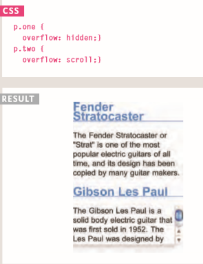

# HTML
*this is my summary :*
there aree three different types of list  :
**Ordered lists** 
 lists where each item in the list is numbered , it is created with the < ol> element , each item in the list is placed between an < li >< /li> tag
 **Unordered lists** 
 lists that begin with a bullet point ,it is created with the < ul> element
**Definition lists** 
* made up of a set of terms along with the definitions for each of those terms, 
* it is created with the < dl> element  
* < dt> used to contain the term being defined 
* < dd> this is used to contain the definition
*You can put a second list inside an < li> element to create a sublist or nested list.*
**box**
* To set your own dimensions for abox you can use the height and width properties.
*  we use min-(width,hight)  or max-(wigth,height) property to display the smallest (widthor lenght)  box or the maximum (width  or length ) box .
*   we use *overflow*  To control what happens when there is not enough space for the content of a box .

* Every box has three available properties that can be adjusted to control its appearance:
1- padding
2- margine
3- border
* use border-width , border-style ,border-color to decorate it .
* use text-align to centering content.
* to change inline/block use :
1- display:inline
2- display : block
3- display :inline-block 
4- display :none 
* use  -moz-border-image: url("images/dots.gif")   11 11 11 11 9stretch or round ); to border image.
* use this to box-shadow   -moz-box-shadow: 5px 5px 5px 5px #777777

# javaScript 
* I read about if...else  statement , switch statement 
*  use type coercion to  convert data types 
* also i read about for and while statement 
* The key difference between a whi1e loop and a do whi1e  loop is that the statements in the code block come before the condition.

