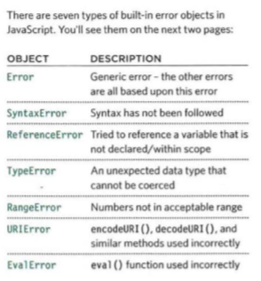

# Read 10
#  Ch. 10 : “Error Handling & Debugging”

- Debugging help us to learn how to find the errors in your code 

- I read about :
* **EXECUTION CONTEXT** types : 

1- GLOBAL CONTEXT *Code that is in the script, but not in a function. There is only one global context in any page*
2- FUNCTION CONTEXT *Code *that is being run within a function. Each function has its own function context*
3- EVAL CONTEXT  *Text is executed like code in an internal function called eval*

*  There are two phases of activity: 
1- Prepare
2- Execute 

* If a JavaScript statement generates an error, then it throws an exception.
 At that point, the interpreter stops and looks for exception-handling code. 

 * **ERROR OBJECTS** 
*Error objects can help you find where your mistakes are and browsers have tools to help you read them*

* **How to deal with errors ?**

1: DEBUG the SCRIPT to fix error
2: HANDLE error Gracefully *using try, catch, throw, and finaly statements*

 **BROWSER DEV TOOLS & JAVASCRIPT CONSOLE**

- Console tell 1- when there is a problem with a JS, where to look, and what kind of issue it seems to be. 
- 2- It also displays the line where it became a problem for the interpreter
- You can also just type code into the console in CHROME and it will show you a result.

- Browsers have a console object, which has several methods that your script can use to display data in the console.
 The object is documented in the Console API. 

 - we can use the console. group () method to group the messages together
- The console. table () method lets you output a table showing: • objects • arrays that contain other objects or arrays.

- using debugger : 
If you set multiple breakpoints, you can step through them one-by-one to see where values change and a problem might occur. 

