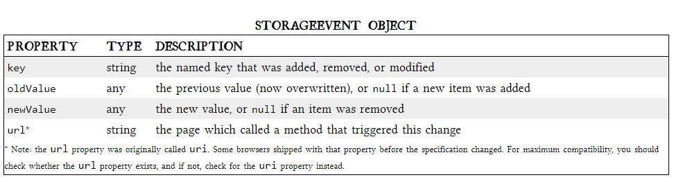

# Read 13

## Local Storage

* I read about :
 - **A BRIEF HISTORY OF LOCAL STORAGE HACKS BEFORE HTML5**
   so In the beginning , there was only Internet Explorer .

- “HTML5 Storage” is a specification named Web Storage, also  refer to it as “Local Storage” or “DOM Storage.”

**what is HTML5 Storage?**

-  it’s a way for web pages to store named key/value pairs locally, within the client web browser.

* *HTML5 STORAGE SUPPORT*
IE	FIREFOX	SAFARI	CHROME	OPERA	IPHONE	ANDROID
8.0+	3.5+	4.0+	4.0+	10.5+	2.0+	2.0+

* *to keep track programmatically of when the storage area changes, you can trap the storage event* 

- The storage event is fired on the window object whenever setItem(), removeItem(), or clear() is called and actually changes something.

* 

* Most of the action resides in the string you pass to the executeSql method. This string can be any supported SQL statement, including SELECT, UPDATE, INSERT, and DELETE statements.

